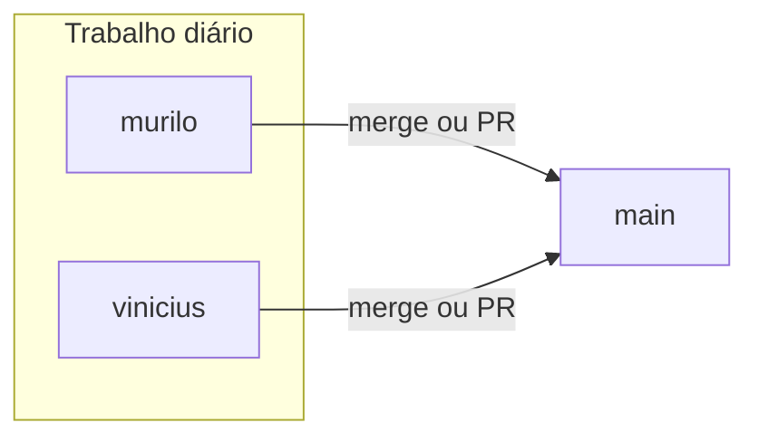

# Colaboração em Git (Gastoo)

Guia para hospedar o projeto remotamente e trabalhar em equipe.

## Modelo de branches (Murilo + Vinícius + Main)

| Branch | Quem usa | Função |
|--------|----------|--------|
| **`main`** | Integração | Código “oficial” reunindo o trabalho dos dois. |
| **`murilo`** | Você | Suas alterações pessoais antes de integrar na `main`. |
| **`vinicius`** | Colega | Alterações do Vinícius antes de integrar na `main`. |



Recomendação: de tempo em tempo, **atualizar** `murilo` e `vinicius` a partir da `main` (`merge main` na sua branch) para reduzir conflitos na hora de juntar tudo.

---

## 1. Repositório remoto e `origin`

1. Crie um repositório **vazio** no [GitHub](https://github.com/new), GitLab ou outro serviço (sem README nem licença se você já tem commits locais).
2. Na pasta do projeto:

```bash
git remote add origin https://github.com/SEU_USUARIO/gastoo-app.git
```

(Substitua pela URL SSH ou HTTPS do seu repositório.)

Para conferir:

```bash
git remote -v
```

## 2. Primeiro envio (`main`)

```bash
git status
git add .
git commit -m "chore: estado inicial para colaboração"
git branch -M main
git push -u origin main
```

Se o remoto já tiver um commit inicial (README), use `git pull origin main --allow-unrelated-histories`, resolva conflitos se houver, depois `git push -u origin main`.

## 3. Convidar o colega

No GitHub: **Settings → Collaborators → Add people** (ou **Manage access** em repositórios da organização).

O colega aceita o convite e clona:

```bash
git clone https://github.com/SEU_USUARIO/gastoo-app.git
cd gastoo-app
npm install
cp .env.example .env
# Edite .env e defina EXPO_PUBLIC_GEMINI_API_KEY
npx expo start
```

## 4. Criar e publicar as branches pessoais (uma vez)

Com a `main` atualizada e já no remoto:

**Branch `murilo` (você):**

```bash
git checkout main
git pull origin main
git checkout -b murilo
git push -u origin murilo
```

**Branch `vinicius` (Vinícius — você pode criar e dar push, ou ele cria no clone dele):**

```bash
git checkout main
git pull origin main
git checkout -b vinicius
git push -u origin vinicius
```

Se a branch já existir no GitHub, cada um só faz:

```bash
git fetch origin
git checkout murilo    # ou vinicius
git pull origin murilo # ou vinicius
```

## 5. Dia a dia — você (Murilo)

```bash
git checkout murilo
git pull origin murilo
# opcional: trazer o que já está na main
git merge origin/main
# ... edita, testa ...
git add .
git commit -m "descrição curta da mudança"
git push origin murilo
```

## 6. Dia a dia — Vinícius

```bash
git checkout vinicius
git pull origin vinicius
git merge origin/main
# ... edita, testa ...
git add .
git commit -m "descrição curta da mudança"
git push origin vinicius
```

## 7. Juntar tudo na `main` (no final do ciclo)

Opção **A — no terminal (um de vocês, com o repositório local limpo):**

```bash
git checkout main
git pull origin main
git merge murilo -m "merge: alterações Murilo"
# resolva conflitos se aparecerem, depois:
git add .
git commit   # só se o merge pedir commit após resolver conflito
git merge vinicius -m "merge: alterações Vinícius"
git add .
git commit   # se necessário
git push origin main
```

Opção **B — Pull Requests no GitHub (recomendado para revisar):**

1. Abrir PR **`murilo` → `main`**, revisar, **Merge**.
2. Na `main` atualizada, abrir PR **`vinicius` → `main`**, revisar, **Merge** (pode haver conflitos se os dois mexeram nos mesmos arquivos — resolver no GitHub ou localmente).

Depois que a `main` subir, os dois atualizam as branches pessoais para não ficarem atrás:

```bash
git checkout murilo
git merge origin/main
git push origin murilo
```

(Repita o mesmo padrão na `vinicius`.)

## Segredos e arquivos ignorados

- `.env` está no `.gitignore` — **não** subir chaves de API.
- Use [`.env.example`](../.env.example) só como modelo de variáveis.
- `node_modules/` e `.expo/` também são ignorados; cada um roda `npm install` após o clone.

## Resumo rápido

| Objetivo | Comando / ação |
|----------|----------------|
| Trabalhar suas mudanças | `git checkout murilo` → commit → `git push origin murilo` |
| Colega trabalha as dele | `git checkout vinicius` → commit → `git push origin vinicius` |
| Integrar na oficial | `main` ← merge de `murilo` e `vinicius` (terminal ou PR) |
| Enviar mudanças | `git add`, `git commit`, `git push` |
| Baixar do remoto | `git pull` na branch em que está |
